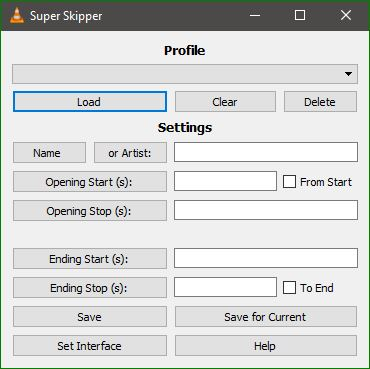

<h1 align="center">Super Skipper</h1>
<h4 align="center">For VLC Media Player</h4>
<h5 align="center">Automatically Skip Opening and Ending Sequences.</h5>

## Installation

Download the repo, copy the `lua` folder (containing [/extensions/super-skipper.lua & /intf/skipper_intf.lua](https://github.com/Trevelopment/vlc-super-skipper/archive/master.zip)) and paste it into your VLC [config-directory][config-dir]:

- Linux:
    - (All Users)
      - `/usr/lib/vlc/`
    - (Current User):
      - `~/.local/share/vlc/`
- MacOS:
    - (All Users)
       - `/Applications/VLC.app/Contents/MacOS/share/`
    - (Current User):
       - `/Users/<name>/Library/Application Support/org.videolan.vlc/`
- Windows:
    - (All Users)
      - `%ProgramFiles%\VideoLAN\VLC\`
    - (Current User):
      - `%APPDATA%\VLC\`

*** *Enable the 'skipper_intf' interface in the 'Set Interface' menu.  This only needs to be done if it is not already enabled. Restart VLC after enabling.* *** 

## Usage

1) From the menu, select <kbd>&nbsp;View&nbsp;>&nbsp;Super Skipper&nbsp;</kbd>. 
2) Set times for <b class=input>openings and endings and a profile name</b> which is compared to the name and artist of the media file. 
3) If Profile equals or is a substring of the <b class=input>name or artist</b> then that profile will be used. 
4) For simplicity all <b class=input>special characters and spaces are stripped before comparing,</b> so profile: <b class=marker_green><code>test123.mp4</code></b> will match to file: <b class=marker_green><code>t e$st1#2@3mp4</code></b> 
    * Search priority is names first then artist, from top to bottom of list.  Uses first found match. 
    * Profiles are saved in a file named <kbd>super-skipper.conf</kbd> in your VLC [config-directory][config-dir]. 
        * you can change the order or adjust times in that file. 

## Features

* <b class=input>Autofill Buttons</b> for name, artist, or current time (s) of the playing media file. 
    * <b class=input>Name:</b> File name. 
    * <b class=input>Artst:</b> Artist. 
    * <b class=input>Opening Start (s):</b> Start of opening credits. Check box <b class=input>From Start</b> for start of video. 
    * <b class=input>Opening Stop (s):</b> End of opening credits. (0 to disable skip opening) 
    * <b class=input>Ending Start (s):</b> Start of ending credits. 
    * <b class=input>Ending Stop (s):</b> End of ending credits. Check box <b class=input>To End</b> for end of video. (0 to disable) 
* <b class=input>Save:</b> Save profile. 
* <b class=input>Save for Current:</b> Set profile to now playing file name and save. 
* <b class=input>Set Interface:</b> Easily set interface settings. 
* <b class=input>Load:</b> Load selected profile values.  
* <b class=input>Clear:</b> Clear all fields. 
* <b class=input>Delete:</b> Delete Selected Profile. 
* <b class=input>Help Menu:</b> With all this information! 

## Contributing

Bug reports, pull requests and ideas or suggestions are welcome on [GitHub](https://github.com/Trevelopment/vlc-super-skipper)

## License

This project is available under the terms of the GNU GPL V3. See the [`LICENSE`](LICENSE) file for the copyleft information.

[config-dir]: https://www.videolan.org/support/faq.html#Config
